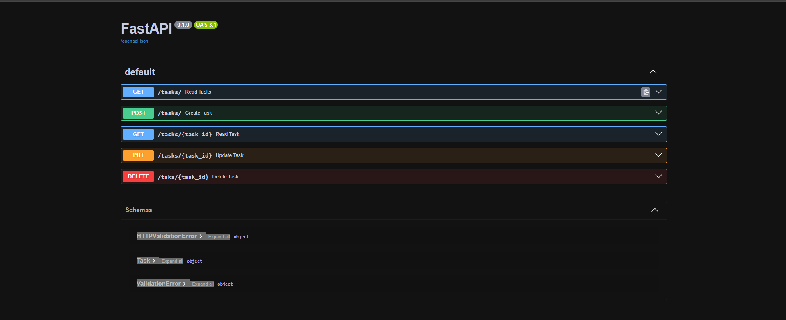

# 🧠 FastAPI Task Manager API

A simple Task Manager REST API built with **FastAPI**, designed to perform CRUD operations on tasks.

---

## 🚀 Features

- ✅ **GET /tasks/** - Retrieve all tasks  
- 🆕 **POST /tasks/** - Create a new task  
- 🔍 **GET /tasks/{task_id}** - Retrieve a specific task by ID  
- ✏️ **PUT /tasks/{task_id}** - Update an existing task  
- ❌ **DELETE /tasks/{task_id}** - Delete a task  

---

## 📸 Interactive API Docs

FastAPI automatically generates interactive API documentation with Swagger UI.  
After running the app, open this URL in your browser:

---

👨‍💻 Author :
Anubhav Choudhary

[LinkedIn](https://www.linkedin.com/in/anubhav-choudhary-35b8ab254/) | [GitHub](https://github.com/ANUBHAV0112)

---